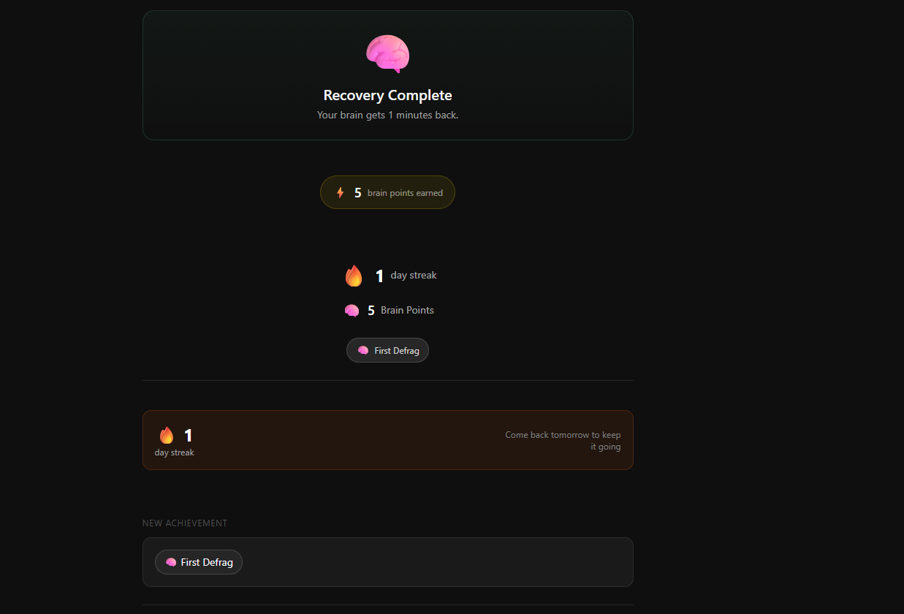

<a href="https://mental-defraug.vercel.app/">
  
</a>

<h1 align="center">🧠 Mental Defrag</h1>

<p align="center">
  <strong>Cognitive recovery for students who work too hard</strong>
</p>

<p align="center">
  <a href="https://mental-defraug.vercel.app/"><strong>🌐 Live App</strong></a> ·
  <a href="#features"><strong>Features</strong></a> ·
  <a href="#tech-stack"><strong>Tech Stack</strong></a> ·
  <a href="#getting-started"><strong>Getting Started</strong></a> ·
  <a href="#screenshots"><strong>Screenshots</strong></a>
</p>

---

## 🚀 Live App

**Try it now:** https://mental-defraug.vercel.app/

---

## 📺 Demo Video

Watch the app in action:


---

## ✨ Features

### Core Functionality
- **AI-Powered Fatigue Classification** — Gemini AI analyzes your session and classifies cognitive fatigue type (Logic, Narrative, Visual, Emotional)
- **Adaptive Recovery Protocols** — 5/7/10 minute recovery sessions based on intensity
- **Ambient Timer** — Beautiful countdown with breathing animations, progress arcs, and step transitions
- **Session Tracking** — Tracks streaks, points, and badges over time

### User Experience  
- **Anonymous First** — No account needed to start
- **Magic Link Auth** — Save streak across devices with email
- **Dashboard** — View fatigue patterns, weekly insights, and session history
- **Settings** — Profile management, email preferences, data export/reset

### Visual Design
- **Premium Dark UI** — Linear-app inspired aesthetic
- **Smooth Animations** — Framer Motion throughout
- **Mobile-First** — Responsive design for all devices

---

## 🛠 Tech Stack

- **Frontend:** Next.js 15 (App Router) + TypeScript
- **Styling:** Tailwind CSS + shadcn/ui
- **Animation:** Framer Motion
- **Database:** Supabase (PostgreSQL)
- **AI:** Google Gemini API
- **Email:** Resend
- **Deployment:** Vercel

---

## 🏗 Getting Started

### Prerequisites
- Node.js 18+
- npm or yarn
- Supabase account
- Gemini API key (from Google AI Studio)

### Installation

1. **Clone the repository:**
```bash
git clone https://github.com/RisAhamed/MENTAL-DEFRAUG.git
cd MENTAL-DEFRAUG
```

2. **Install dependencies:**
```bash
npm install
```

3. **Set up environment variables:**

Copy `.env.example` to `.env.local` and fill in:
```env
NEXT_PUBLIC_SUPABASE_URL=your_supabase_url
NEXT_PUBLIC_SUPABASE_ANON_KEY=your_supabase_anon_key
SUPABASE_SERVICE_ROLE_KEY=your_service_role_key
GEMINI_API_KEY=your_gemini_api_key
RESEND_API_KEY=your_resend_api_key
NEXT_PUBLIC_APP_URL=http://localhost:3000
```

4. **Set up Supabase:**

Run the SQL migrations in your Supabase SQL Editor:
```sql
-- Create users table
CREATE TABLE public.users (
  id UUID PRIMARY KEY DEFAULT gen_random_uuid(),
  email TEXT,
  auth_user_id TEXT,
  first_name TEXT,
  total_points INTEGER DEFAULT 0,
  current_streak INTEGER DEFAULT 0,
  longest_streak INTEGER DEFAULT 0,
  last_defrag_date DATE,
  badges TEXT[] DEFAULT '{}',
  created_at TIMESTAMPTZ DEFAULT NOW()
);

-- Create sessions table
CREATE TABLE public.sessions (
  id UUID PRIMARY KEY DEFAULT gen_random_uuid(),
  user_id UUID REFERENCES users(id),
  input_text TEXT,
  fatigue_type TEXT,
  intensity TEXT,
  total_duration INTEGER,
  protocol JSONB,
  timer_completed BOOLEAN DEFAULT false,
  feeling_after TEXT,
  points_earned INTEGER DEFAULT 0,
  created_at TIMESTAMPTZ DEFAULT NOW()
);

-- Enable RLS
ALTER TABLE users ENABLE ROW LEVEL SECURITY;
ALTER TABLE sessions ENABLE ROW LEVEL SECURITY;
```

5. **Run development server:**
```bash
npm run dev
```

6. **Open http://localhost:3000**

---

## 📸 Screenshots

### Input Page
The main entry point where users describe their cognitive session.


### Result Page  
The AI-generated recovery protocol with fatigue classification.

### Timer Page
Beautiful ambient timer with breathing animations and step guidance.

### Done Page
Completion screen with streak tracking, points, and achievements.

---

## 📁 Project Structure

```
mental-defrag/
├── app/
│   ├── page.tsx              # Input page (home)
│   ├── result/page.tsx        # Protocol result
│   ├── timer/page.tsx        # Ambient timer
│   ├── done/page.tsx         # Completion screen
│   ├── dashboard/page.tsx     # User dashboard
│   ├── settings/page.tsx     # Settings page
│   ├── landing/page.tsx      # Marketing landing page
│   └── api/                 # API routes
├── components/              # React components
├── lib/                     # Utility functions
├── types/                   # TypeScript types
└── public/                  # Static assets
```

---

## 🔧 API Routes

| Route | Description |
|-------|-------------|
| `/api/defrag` | Generate AI protocol |
| `/api/save-session` | Save completed session |
| `/api/user-stats` | Get user statistics |
| `/api/sessions` | Get session history |
| `/api/brain-summary` | Weekly fatigue breakdown |
| `/api/generate-insight` | AI-powered insights |
| `/api/send-magic-link` | Email authentication |
| `/api/reset-user` | Reset user data |

---

## 📄 License

MIT License - feel free to use this for your own projects!

---

## 🤝 Contributing

Contributions are welcome! Please feel free to submit a Pull Request.

---

<p align="center">
  Built with ❤️ for students who work too hard
</p>
